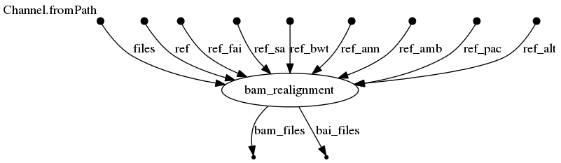

# alignment-nf

## Nextflow pipeline for BAM realignment or fastq alignment
[](https://circleci.com/gh/IARCbioinfo/alignment-nf)
[](https://hub.docker.com/r/iarcbioinfo/alignment-nf/)
[](https://singularity-hub.org/collections/4522)


## Description

Nextflow pipeline to perform BAM realignment or fastq alignment and QC, with/without local indel realignment and base quality score recalibration.

## Dependencies

1. Nextflow : for common installation procedures see the [IARC-nf](https://github.com/IARCbioinfo/IARC-nf) repository.

### Basic fastq alignment
2. [*bwa2*](https://github.com/bwa-mem2/bwa-mem2) (default) or [*bwa*](https://github.com/lh3/bwa)
3. [*samblaster*](https://github.com/GregoryFaust/samblaster)
4. [*sambamba*](https://github.com/lomereiter/sambamba)

### BAM files realignment
5. [*samtools*](http://samtools.sourceforge.net/)

### Adapter sequence trimming
6. [*AdapterRemoval*](https://github.com/MikkelSchubert/adapterremoval)

### ALT contigs handling
7. the *k8* javascript execution shell (e.g., available in the [*bwakit*](https://sourceforge.net/projects/bio-bwa/files/bwakit/) archive); must be in the PATH
8. javascript bwa-postalt.js and the additional fasta reference *.alt* file from [*bwakit*](https://github.com/lh3/bwa/tree/master/bwakit) must be in the same directory as the reference genome file.

### QC
9. [Qualimap](http://qualimap.bioinfo.cipf.es). 
10. [Multiqc](http://multiqc.info). 

### Base quality score recalibration
11. [GATK4](https://software.broadinstitute.org/gatk/guide/quickstart); wrapper 'gatk' must be in the path
12. [GATK bundle](https://software.broadinstitute.org/gatk/download/bundle) VCF files with lists of indels and SNVs (recommended: Mills gold standard indels VCFs, dbsnp VCF), and corresponding tabix indexes (.tbi)

**A conda receipe, and docker and singularity containers are available with all the tools needed to run the pipeline (see "Usage")**

### Indexes
13. To create the bwa indexes
```bash
singularity exec -B $(pwd):/mnt/ shub://IARCbioinfo/alignment-nf:v1.3 bwa-mem index reference.fasta
singularity exec -B $(pwd):/mnt/ shub://IARCbioinfo/alignment-nf:v1.3 bwa-mem2 index reference.fasta
```
14. To cretae the reference.fai index
```bash
singularity exec -B $(pwd):/mnt/ shub://IARCbioinfo/alignment-nf:v1.3 samtools faidx reference.fasta
```
15. To create the reference.dict index
```bash
singularity exec -B $(pwd):/mnt/ shub://IARCbioinfo/alignment-nf:v1.3 gatk CreateSequenceDictionary -R reference.fasta
```

## Input 
 | Type      | Description     |
  |-----------|---------------|
  | --input_folder    | a folder with fastq files or bam files |

## Parameters

* #### Mandatory

| Name | Example value | Description |
|-----------|--------------|-------------| 
|--ref    | hg19.fasta | genome reference  with its index files (*.fai*, *.sa*, *.bwt*, *.ann*, *.amb*, *.pac*, and *.dict*; in the same directory) |

* #### Optional

| Name | Default value | Description |
|-----------|--------------|-------------| 
|--input_file   | null | Input file (comma-separated) with 4 columns: SM (sample name), RG (read group ID), pair1 (first fastq of the pair), and pair2 (second fastq of the pair). |
|--output_folder   | . | Output folder for aligned BAMs|
|--cpu          | 8 | number of CPUs |
|--cpu\_BQSR | 2 | number of CPUs for GATK base quality score recalibration |
|--mem         | 32 | memory|
|--mem\_BQSR | 10 | memory for GATK base quality score recalibration |
|--RG           | PL:ILLUMINA | sequencing information for aligned (for *bwa*)|
|--fastq_ext    | fastq.gz | extension of fastq files|
|--suffix1      | \_1 | suffix for second element of read files pair|
|--suffix2      | \_2 | suffix for second element of read files pair|
|--snp_vcf  | dbsnp.vcf | path to SNP VCF from GATK bundle (default : dbsnp.vcf) |
|--indel_vcf  | Mills_1000G_indels.vcf | path to indel VCF from GATK bundle (default : Mills_1000G_indels.vcf) |
|--postaltjs    | bwa-postalt.js" | path to postalignment javascript *bwa-postalt.js*|
|--feature_file  | null |    Path to feature file for qualimap |
|--multiqc_config   |  null | config yaml file for multiqc | 
|--adapterremoval_opt   |  null | Command line options for AdapterRemoval | 
|--bwa_mem  | bwa-mem2 mem | bwa-mem command; use "bwa mem" to switch to regular bwa-mem (both are in the docker and singularity containers) |

* #### Flags

Flags are special parameters without value.

| Name  | Description |
|-----------|-------------| 
| --help | print usage and optional parameters |
|--trim     | enable adapter sequence trimming|
|--recalibration  | perform quality score recalibration (GATK)|
|--alt         | enable alternative contig handling (for reference genome hg38)|
|--bwa_option_M  | Trigger the -M option in bwa and the corresponding compatibility option in samblaster (marks shorter split hits as secondary) |

## Usage
To run the pipeline on a series of fastq or BAM files in folder *input* and a fasta reference file hg19.fasta, one can type:
  
```bash
nextflow run iarcbioinfo/alignment-nf -r v1.3 -profile singularity  --input_folder input/ --ref hg19.fasta --output_folder output
```

To run the pipeline without singularity just remove "-profile singularity". Alternatively, one can run the pipeline using a docker container (-profile docker) the conda receipe containing all required dependencies (-profile conda).


### Use bwa-mem instead of bwa-mem2
To use bwa-mem, one can type:
  
```bash
nextflow run iarcbioinfo/alignment-nf -r v1.3 -profile singularity  --input_folder input/ --ref hg19.fasta --output_folder output --bwa_mem "bwa mem"
```

### Enable adapter trimming
To use the adapter trimming step, you must add the ***--trim* option**, as well as satisfy the requirements above mentionned. For example:
```bash
nextflow run iarcbioinfo/alignment-nf -r v1.3 -profile singularity  --input_folder input/ --ref hg19.fasta --output_folder output --trim
```

### Enable ALT mode
To use the alternative contigs handling mode, you must provide the **path to an ALT aware genome reference** (e.g., hg38) AND add the ***--alt* option**, as well as satisfy the above-mentionned requirements. For example:
```bash
nextflow run iarcbioinfo/alignment-nf -r v1.3 -profile singularity  --input_folder input/ --ref hg19.fasta --output_folder output --postaltjs /user/bin/bwa-0.7.15/bwakit/bwa-postalt.js --alt
```

### Enable base quality score recalibration
To use the base quality score recalibration step, you must provide the **path to 2 GATK bundle VCF files** with lists of known snps and indels, respectively, AND add the ***--recalibration* option**, as well as satisfy the requirements above mentionned. For example:
```bash
nextflow run iarcbioinfo/alignment-nf -r v1.3 -profile singularity  --input_folder input/ --ref hg19.fasta --output_folder output --snp_vcf GATKbundle/dbsnp.vcf.gz --indel_vcf GATKbundle/Mills_1000G_indels.vcf.gz --recalibration
```

## Output 
  | Type      | Description     |
  |-----------|---------------|
  | BAM/    | folder with BAM and BAI files of alignments or realignments |
  | QC/BAM/multiqc_qualimap_flagstat_*report.html  | multiQC report for qualimap and samtools flagstat (duplicates) |
  | QC/BAM/multiqc_qualimap_flagstat_*report_data  | data used for the multiQC report |
  | QC/qualimap/file_BQSRecalibrated.stats.txt  | qualimap summary file |
  | QC/qualimap/file_BQSRecalibrated/  | qualimap files |
  | QC/BAM/BQSR/  | GATK base quality score recalibration outputs (tables and pdf comparing scores before/after recalibration)|
  
## Directed Acyclic Graph
[](http://htmlpreview.github.io/?https://github.com/IARCbioinfo/alignment-nf/blob/dev/dag.html)

## FAQ
### Why did Indel realignment disappear from version 1.0?
Indel realignment was removed following new GATK best practices for pre-processing.

## Contributions

  | Name      | Email | Description     |
  |-----------|---------------|-----------------| 
  | Nicolas Alcala*    | AlcalaN@fellows.iarc.fr    | Developer to contact for support |
  | Catherine Voegele    |     VoegeleC@iarc.fr | Tester |
  | Vincent Cahais | CahaisV@iarc.fr | Tester |
  | Alexis Robitaille | RobitailleA@students.iarc.fr | Tester |
  
